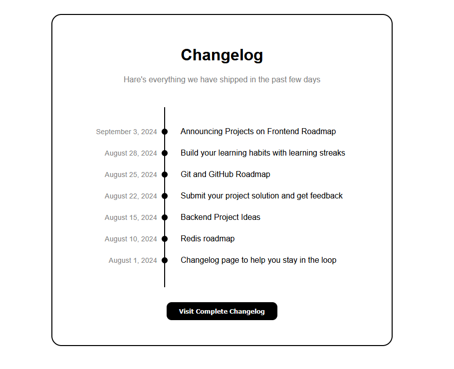

# Changelog Website

This is a simple **Changelog page** built with **HTML** and **CSS**.  
It displays recent updates in a timeline format with dates, titles, and a vertical line connecting the events.  

---

## Live Demo
[View Project](https://apacy.github.io/Changelog/)

---

## Features
- Clean and minimal timeline design  
- Dates and events aligned with connecting line  
- Interactive hover button to visit the full changelog  
- Responsive and centered layout  

---

## Preview 

---

## Technologies Used
 - HTML5 for structure
 - CSS3 for styling

